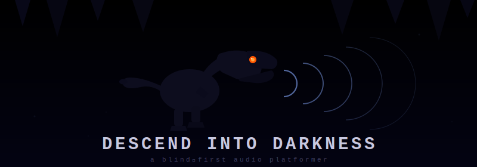

# Descend into Darkness

**Archived experiment: a blind-first audio platformer. Descend. Survive. Listen.**

> Rex the dinosaur and Dr. Mara Voss descend into a cave that gets darker with every level.  
> The darkness is not a bug. It is the game. You navigate by sound.

**[▶ Play Live Demo](https://karma-works.github.io/descend-into-darkness/)**

---

## Project Status

This project is archived.

The challenge was greater than the ambition. This repository remains available as a record of the prototype, the decisions made, and the lessons learned, but it is not being actively developed.

---

## Learnings

### Adapting sighted gameplay is the wrong starting point

Adapting an existing game or gameplay pattern built for sighted players may work for some accessibility layers. It is fundamentally the wrong approach when creating a game for blind players.

A platformer relies on fast optical input processing. The equivalent for blind players would be a very fast game that relies entirely on audio input processing. That is possible in theory, but very hard to achieve well. It cannot be treated as "platformer, but with sounds."

### WCAG AAA is the wrong frame for this problem

WCAG 2.2 Level AAA is not the right standard for this kind of game. It is primarily a standard for accessible page components and static or semi-static web experiences. Real-time games are built around timing, perception, and response under pressure.

WCAG can still inform UI and documentation quality, especially for visually impaired players, but it is not enough to define whether a blind-first game works.

### AI was not enough of a sparring partner

AI was not a sufficiently strong sparring partner for developing a game for blind players. Real users, real playtesting, and lived experience are required.

This project produced plausible architecture and plausible code. That is not the same thing as a good blind-first game.

### Stereo is not enough for spatial understanding

Stereo sound is not sufficient to convey 3D orientation: up, down, left, right, distance, urgency, and identity all compete for the same perceptual channel.

Introducing extra encodings, such as pitch for height, can work, but it feels bolted on unless the entire game is designed around that language from the beginning. New audio concepts must be taught through an audio tutorial, then reinforced through consistent level design.

---

## Assumptions For Future Blind-First Projects

Games for blind players have to start with sound design.

First define the feeling the game should convey. Storytelling comes before mechanics. The experience should be closer to audio drama, music, or interactive soundscape design than a visual game with an accessibility layer added later.

Browser TTS in modern browsers, even in 2026, is not adequate for a game where voice carries emotion and atmosphere. Blind players may already use specialized TTS tools, but game voice has a different job. It must convey feeling, character, pacing, and tension.

Voice should be treated like performance. Sound effects should be treated like worldbuilding. Realistic sounds matter for immersion. The audio system is not an output layer. It is the game.

---

## What this game is

**Descend into Darkness** is a real-time audio platformer. There is no visual gameplay — the game is played entirely through sound. A screen is not required to play.

You are **Rex**, a dinosaur descending into an ancient cave. Your companion **Dr. Mara Voss**, a paleontologist, descends with you. She translates. She warns. She slowly loses the torch.

Each level is deeper, darker, and more hostile. Mara gets quieter. The cave gets stranger. Something has been following you since Level 9.

### What you hear

- **Spatial audio grammar** — every entity communicates four things at once: identity through sound material, direction through stereo position, distance through volume and pulse rate, and urgency through rhythm.
- **Echolocation** — press `Q` to emit a directional ping. Nearby entities answer with their own sound signatures, sequenced nearest-first.
- **Dr. Mara Voss** — she teaches the sound grammar, narrates your death, guides you through the shop, and can optionally summarize echolocation when verbose mode is enabled.
- **Silence** — the most dangerous sound in the game.

---

## Controls

| Action | Key |
|---|---|
| Move left | `A` or `←` |
| Move right | `D` or `→` |
| Jump | `Space` or `↑` |
| Spit fire | `F` |
| Echolocation ping | `Q` |
| Talk to Merchant | `E` |
| Pause | `Escape` |
| Mute | `M` |
| Toggle mono spatial mode | `B` |
| Toggle verbose Mara | `V` |
| Toggle reduced threat speed | `R` |
| Effects volume | `[` / `]` |
| Speech volume | `;` / `'` |

**Recommended: headphones.** Stereo separation is how the game communicates spatial information. Mono mode exists for players with single-ear hearing or speaker constraints, but it necessarily removes left/right play.

---

## Enemies

| Enemy | Sound | Behaviour |
|---|---|---|
| Cave Crawler | Low rasping, 80 BPM | Slow patrol. Predictable. Learn the rhythm. |
| Bat Swarm | High flutter, 200 BPM | Fast, chaotic. Move before it reaches you. |
| Shadow Wraith | Arrhythmic breath, near-silent | No footsteps. No pattern. When the cave goes quiet — move. |

---

## Dr. Mara Voss

Paleontologist. She found Rex's fossil site six years ago and chose not to publish. Some things should not be in a journal.

She begins the descent with a torch, maps, and confidence. The torch dies at Level 5. The maps end at Level 8. At Level 9, she stops explaining what she hears and starts just whispering directions.

Her humor gets darker as you go deeper. She never says she's scared. Listen for what she doesn't say.

---

## Difficulty Curve

| Depth | New threat | Mara's mood |
|---|---|---|
| 1–2 | Falling debris only | Talkative, teaching |
| 3–4 | Cave Crawlers | Scientific, precise |
| **5** | **Boss 1** | *"I've seen this before. In the fossil record."* |
| 6–8 | Bat Swarms | Urgent, clipped |
| 9 | Shadow Wraith first appears | Goes quiet |
| **10** | **Boss 2** | Changed. Something shifted. |
| 11+ | Elite variants, near-instant debris | Mostly silent. Occasional dark humor. |

---

## Accessibility

This game targets the **ARIA Authoring Practices Guide** for assistive technology compatibility. It deliberately does not claim WCAG 2.2 Level AAA — real-time games are structurally incompatible with Success Criterion 2.2.3 (No Timing), and claiming otherwise would be dishonest.

**What is implemented:**
- `role="application"` with full keyboard-only navigation
- `role="log"` ARIA live region for discrete game events (checkpoint, treasure, death narration)
- `role="alert"` ARIA live region for critical warnings
- All controls reachable via keyboard, no mouse required
- Pre-rendered Mara voice assets for authored character lines, with Web Speech API fallback
- Web Audio API spatial encoding for gameplay information
- Optional mono mode, verbose Mara, reduced threat speed, and separate speech/effects volume controls
- No canvas — the HTML document is the game interface

**Screen reader testing:** local ARIA structure is implemented; independent VoiceOver, NVDA, and JAWS gameplay feedback is still needed.
**Note:** For real-time gameplay, Web Audio spatial audio is the primary information channel. Screen reader live regions carry discrete events (things that happened once), not continuous state. This is by design — continuous state in live regions floods the screen reader queue.

---

## Tech Stack

| | |
|---|---|
| **Runtime / Bundler** | [Bun](https://bun.sh/) |
| **Language** | TypeScript (strict) |
| **Audio** | Web Audio API (procedural gameplay audio + authored Mara clip playback) |
| **Voice** | Pre-rendered Mara assets for authored lines; Web Speech API for fallback and dynamic tactical speech |
| **UI** | HTML5 + ARIA (no canvas) |
| **Persistence** | `localStorage` (depth record) |

---

## Getting Started

```bash
# Install Bun (if needed)
curl -fsSL https://bun.sh/install | bash

# Start dev server (http://localhost:3000)
bun run dev

# Typecheck
bun run typecheck

# Production build → public/bundle.js
bun run build
```

**Requires headphones for the intended experience.**

---

## Project Structure

```
descend-into-darkness/
├── public/
│   ├── index.html        HTML shell — ARIA structure, no canvas
│   └── bundle.js         Built output (generated)
├── src/
│   ├── main.ts           Entry point
│   ├── constants.ts      Tuning values
│   ├── types.ts          Shared interfaces & enums
│   ├── Input.ts          Keyboard handler
│   ├── ThreatBus.ts      Priority queue for audio events
│   ├── SpatialAudio.ts   Web Audio API — spatial positioning, echolocation
│   ├── MaraEngine.ts     Dr. Mara Voss — arc-aware narration router
│   ├── MaraLines.ts      Authored Mara line manifest
│   ├── MaraVoicePlayer.ts Centered Web Audio playback for rendered Mara lines
│   ├── ARIALog.ts        Discrete event announcer
│   ├── Level.ts          Procedural cave level generator
│   ├── Physics.ts        Real-time physics
│   ├── Game.ts           Game loop and state machine
│   └── entities/
│       ├── Rex.ts        Player character
│       ├── Debris.ts     Falling cave rock
│       ├── Enemy.ts      Crawler / Bat / Wraith
│       ├── Crystal.ts    Collectible gem
│       ├── Merchant.ts   Shop NPC
│       └── Boss.ts       Boss — breathing arc, phase 2
├── specs/
│   ├── adr-001-blind-first-architecture.md
│   ├── adr-002-no-canvas.md
│   ├── adr-003-spatial-audio-primary.md
│   ├── adr-004-mara-voss-companion.md
│   ├── adr-005-threat-design.md
│   ├── adr-006-aria-event-log.md
│   └── implementation-plan.md
├── server.ts
├── package.json
└── tsconfig.json
```

---

## Design Documents

- [ADR-001: Blind-first architecture](specs/adr-001-blind-first-architecture.md)
- [ADR-002: No canvas](specs/adr-002-no-canvas.md)
- [ADR-003: Spatial audio as primary sense](specs/adr-003-spatial-audio-primary.md)
- [ADR-004: Dr. Mara Voss](specs/adr-004-mara-voss-companion.md)
- [ADR-005: Threat design](specs/adr-005-threat-design.md)
- [ADR-006: ARIA event log](specs/adr-006-aria-event-log.md)
- [Implementation plan](specs/implementation-plan.md)

---

## License

[MIT](LICENSE) © 2026 karma-works
